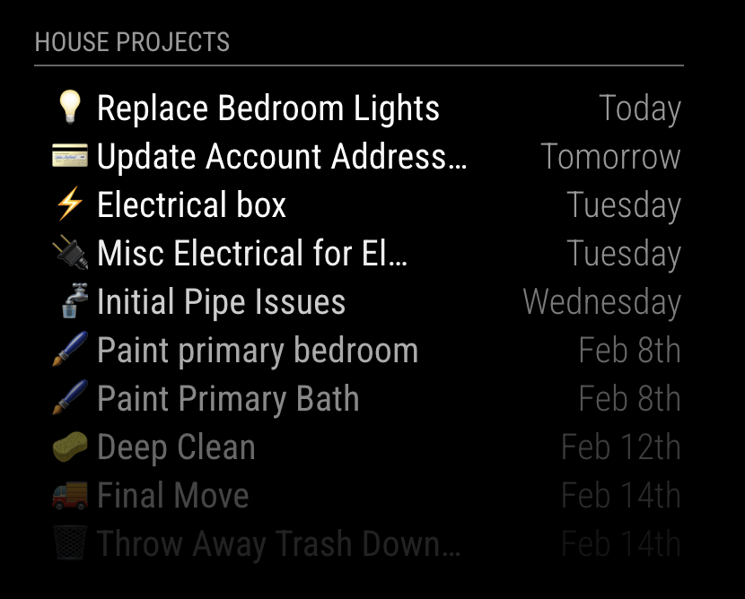

# MMM-NotionCalendar

This is a module for the [MagicMirror²](https://github.com/MagicMirrorOrg/MagicMirror/).

This module provides an internal iCal feed of a Notion database that can be used in the [MagicMirror Calendar module](https://docs.magicmirror.builders/modules/calendar.html).

<div style="max-width: 400px;">
  
</div>

Notion events displayed in the MagicMirror Calendar module.

## Installation

In ~/MagicMirror/modules

```sh
git clone https://github.com/JHWelch/MMM-NotionCalendar.git

npm install --omit=dev
```

## Obtaining Notion Secrets

### Notion API Key

1. Open [Notion Integrations](https://www.notion.so/profile/integrations)
2. Click "New Integration"
3. Fill out Details
   1. Name: Anything (MMM)
   2. Associated workspace: Pick target workspace
   3. Type: Internal
   4. Click Save
4. Click "Configure integration settings"
5. Copy "Internal Integration secret" for use in config (`notionToken`)
6. Set "Capabilities" this app only requires
   1. Content Capabilities: Read Content
   2. User Capabilities: Read user information without email address
7. In "Access" tab edit access and select your database.

### Data Source Id

1. Open the page of your database.
2. Open the table menu and select "Manage Data Sources"
3. Select the desired data source and "Copy data source ID"
4. Save for use in url (`dataSourceId`)

## Using the module

Add the following to the `modules` array in `config/config.js`. It does not require any configuration options or position. Config options will be passed in the URL of the calendar feed.

```js
{
    module: 'MMM-NotionCalendar',
}
```

Add the following to the `calendars` array in the configuration of the default `calendar` module.

```js
{
    url: 'http://localhost:8080/MMM-NotionCalendar.ics?notionToken=YOUR_NOTION_TOKEN&dataSourceId=YOUR_DATA_SOURCE_ID',
}
```

To easily obtain a URL with the correct parameters, as well as adding additional options, you can use the [Notion Calendar URL Generator](https://jhwelch.github.io/MMM-NotionCalendar/).

## Development

Install dev dependencies

```sh
npm install
```

### Testing

There is a test suite using Jest.

```sh
node --run test
```

### Linting

There is linting using ESLint

```sh
# Run linting
node --run lint

# Fix linting errors
node --run fix
```
